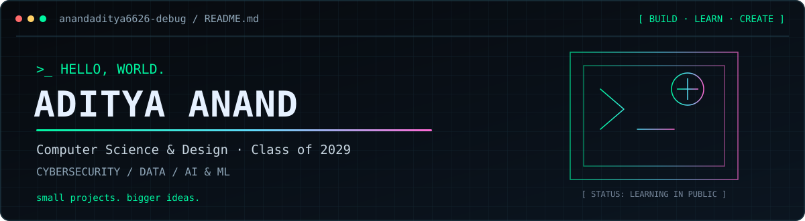
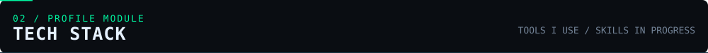
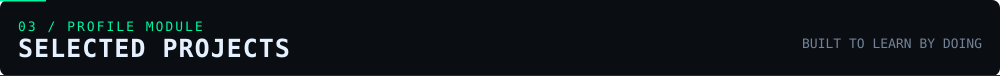
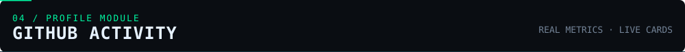
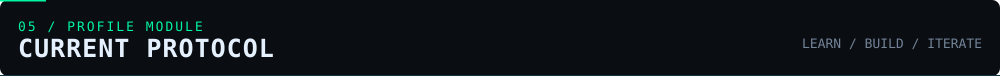
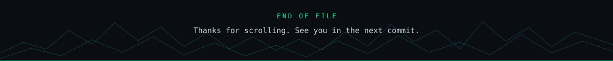

<div align="center">



<br/>

[](https://future-fs-01-livid-iota.vercel.app/)
[](https://github.com/anandaditya6626-debug)
[](mailto:aditya07anand@gmail.com)

`CSD STUDENT` &nbsp;·&nbsp; `BUILDER` &nbsp;·&nbsp; `ALWAYS LEARNING`

</div>


```text
Aditya Anand / B.Tech Computer Science & Design
Dr. B. C. Roy Engineering College · Class of 2029 · India

I like building useful things, understanding how systems work,
and turning ideas into projects people can actually use.

CURRENTLY EXPLORING
[01] Cybersecurity       — Linux, networking, web security
[02] Data Analytics      — Python, SQL, data-driven decisions
[03] AI / ML Engineering — intelligent systems and computer vision
```



<div align="center">


</div>



<table>
<tr>
<td width="50%" valign="top">

### `01` — Code Mentor
**Developer tools · In progress**

A code editor/compiler concept focused on helping learners spot mistakes and understand what to do next.

[↗ Repository](https://github.com/anandaditya6626-debug/CODEMENTOR)

</td>
<td width="50%" valign="top">

### `02` — VeloraCRM
**Full-stack · Lead management**

A client lead management system for organizing leads and tracking their progress.

[↗ Live demo](https://velora-frontend.vercel.app/)

</td>
</tr>
<tr>
<td width="50%" valign="top">

### `03` — Budget Buddy
**Personal finance**

A budgeting app designed to help users plan expenses and manage a monthly salary.

[↗ Live demo](https://budget-buddy-two-kappa.vercel.app/)

</td>
<td width="50%" valign="top">

### `04` — AI Hand Detector
**AI · Computer vision**

A browser-based experiment exploring real-time hand detection.

[↗ Live demo](https://hand-detector-two.vercel.app/)

</td>
</tr>
<tr>
<td width="50%" valign="top">

### `05` — Nexora
**Web experience**

A modern web project focused on interactive UI and visual design.

[↗ Live demo](https://nexora-seven-sooty.vercel.app/)

</td>
<td width="50%" valign="top">

### `06` — Portfolio
**Personal website**

A custom portfolio built with vanilla HTML, CSS, and JavaScript.

[↗ Live site](https://future-fs-01-livid-iota.vercel.app/) · [↗ Source](https://github.com/anandaditya6626-debug/FUTURE_FS_01)

</td>
</tr>
</table>



<div align="center">


<br/>


<br/>


</div>



```text
> learn the fundamentals
> build small, real projects
> document the process
> keep showing up
```

<div align="center">

### `SMALL PROJECTS. BIGGER IDEAS.`

*Learning in public — one commit at a time.*



</div>
